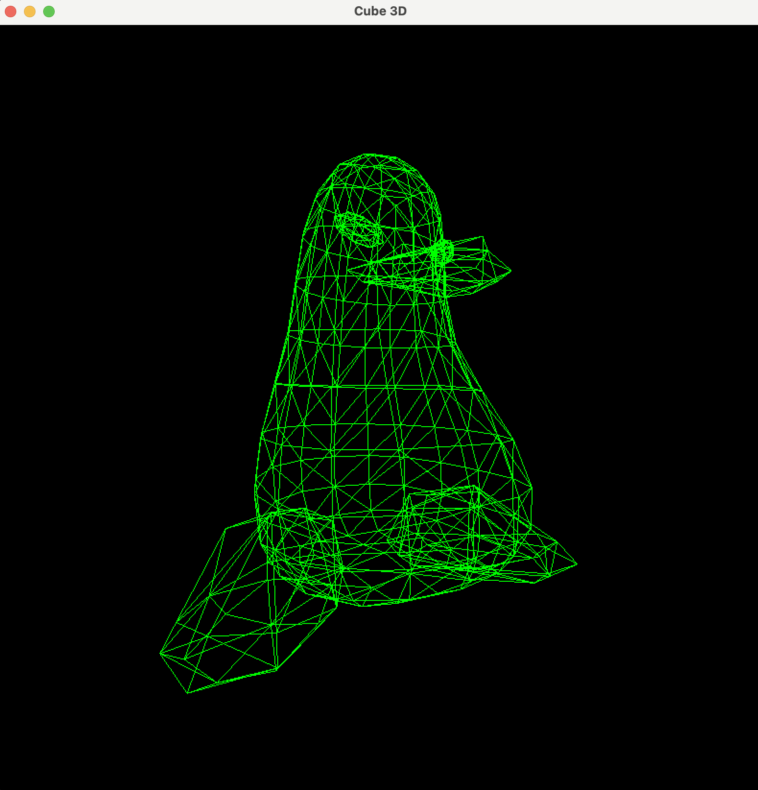

# Stuff3D

A simple software 3D renderer built in C++ using SFML.

The project renders 3D models from scratch using perspective projection without relying on OpenGL or other 3D graphics APIs. It is a playground for learning the fundamentals of computer graphics, camera systems, and the 3D rendering pipeline.



## Features

- Perspective projection
- Wireframe rendering
- OBJ-style vertex and face data
- Camera movement
- Y-axis model rotation
- Simple rendering pipeline written from scratch

## Controls

| Key | Action |
|------|--------|
| W | Move forward |
| S | Move backward |
| A | Strafe left |
| D | Strafe right |
| Q | Rotate camera left |
| E | Rotate camera right |

## Tech Stack

- C++17
- SFML 3
- CMake

## Project Structure

```
.
├── src/
│   ├── main.cpp
│   ├── penger.cpp
│   └── penger.h
├── app.png
├── CMakeLists.txt
└── README.md
```

## Future Improvements

- Mouse-look camera
- Pitch rotation
- Near-plane clipping
- Back-face culling
- Filled triangles
- Z-buffer
- Lighting and shading
- OBJ file loader
- Texture mapping

## Build

```bash
mkdir build
cd build
cmake ..
cmake --build .
```

## Inspiration

This project is built as a learning exercise to better understand how a basic 3D graphics engine works under the hood before using APIs like OpenGL or Vulkan.