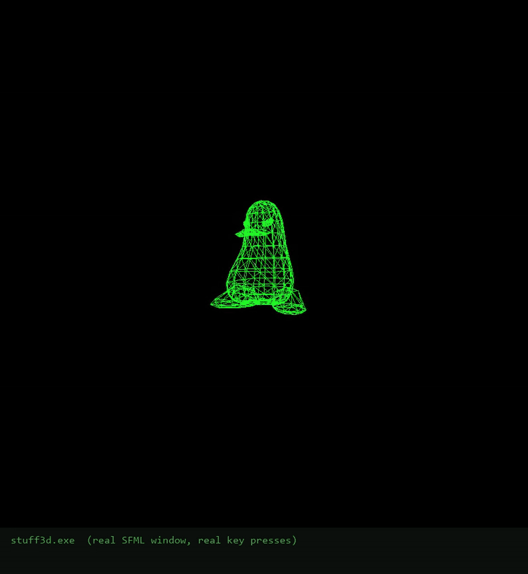
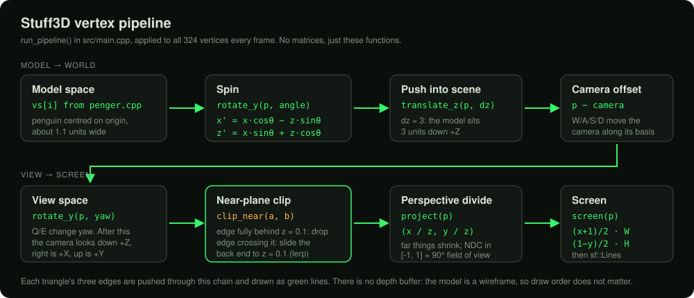
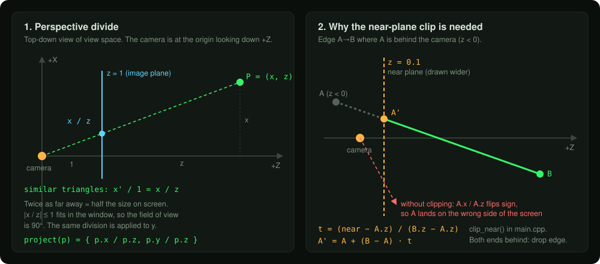
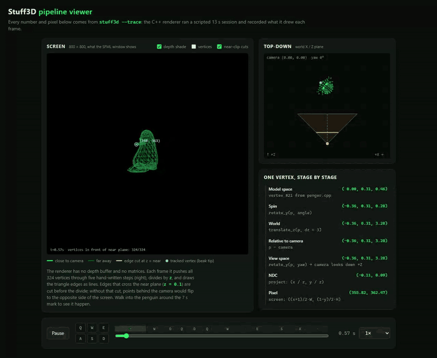
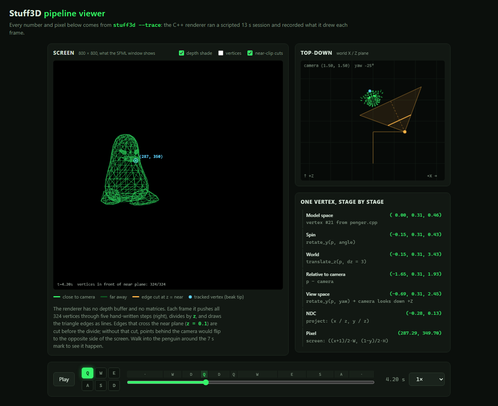
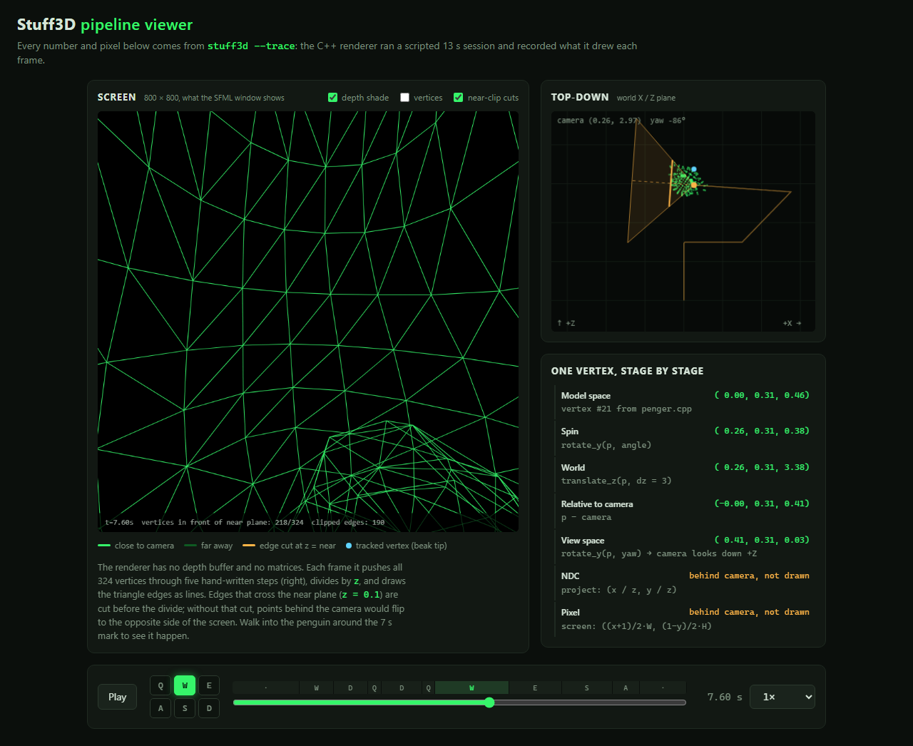
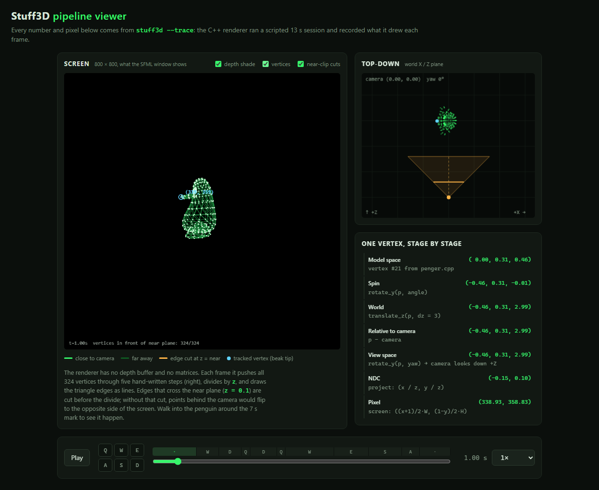

# Stuff3D

A software 3D wireframe renderer in about 300 lines of C++. It uses SFML only to open a window and draw 2D lines; the 3D part (rotation, camera, near-plane clipping, perspective divide) is written by hand.



*The real SFML window, recorded with ffmpeg while a script held down W/A/S/D/Q/E. [MP4 version](docs/media/demo.mp4).*

## What it does

It loads a 324-vertex, 624-triangle penguin mesh (`src/penger.cpp`), spins it about its Y axis, and lets you walk around it with a first-person camera. Every frame, every vertex goes through the same small chain of functions and every triangle edge is drawn as a green line.

| Key | Action |
|-----|--------|
| W / S | Move forward / back |
| A / D | Strafe left / right |
| Q / E | Turn left / right |
| Esc | Quit |

## How it works



`run_pipeline()` in `src/main.cpp` is the whole renderer:

1. **Spin**: `rotate_y(p, angle)` turns the model about its own Y axis. `angle` grows by π/2 per second.
2. **Push into the scene**: `translate_z(p, 3)` puts the model 3 units in front of the origin.
3. **Camera offset**: subtract the camera position, so the camera sits at (0, 0, 0).
4. **View space**: `rotate_y(p, yaw)` turns the world so the camera looks down +Z. W/S move along `(sin yaw, 0, cos yaw)`, A/D along `(cos yaw, 0, −sin yaw)`.
5. **Near-plane clip**: `clip_near(a, b)` drops an edge that is fully behind z = 0.1 and shortens one that crosses it.
6. **Perspective divide**: `(x / z, y / z)`. Anything with |x/z| ≤ 1 is on screen, which gives a 90° field of view.
7. **Screen**: map [-1, 1] to 800 × 800 pixels, flipping Y, and draw with `sf::PrimitiveType::Lines`.



Step 5 matters as soon as you walk into the model. A point behind the camera has negative z, so `x / z` flips sign and the vertex gets drawn on the opposite side of the screen, which fills the window with long garbage lines. Clipping each edge at z = 0.1 before the divide fixes that.

## Pipeline viewer (web)

`web/index.html` replays a trace written by the C++ program. `stuff3d --trace web/trace.js` runs the same `update()` and `run_pipeline()` code headlessly, drives it with a scripted 13-second key sequence instead of the keyboard, and records each frame: projected pixel and view depth for every vertex, the clipped edges, the camera state, and every intermediate value for one vertex (the beak tip). The page draws those pixels directly and does not re-project the model.



It shows:

- the screen, with edges shaded by depth and near-plane cuts in amber,
- a top-down map of the camera path, heading, 90° frustum and near plane,
- the beak-tip vertex at each stage, from model space to pixel, with the numbers for the current frame,
- a timeline of the key presses. Space pauses, the arrow keys step one frame, and the slider scrubs.

| Orbiting | Inside the model (near clip) | Vertices shown |
|---|---|---|
|  |  |  |

The trace is a `.js` file (`window.TRACE = {...}`), so the page also works when opened straight from disk, with no server.

## Quick start

You need CMake 3.28+ and a C++17 compiler. CMake downloads SFML 3.1 through `FetchContent`; on Linux, install the SFML system dependencies first (see `.github/workflows/ci.yml`).

```sh
cmake -B build
cmake --build build --config Release
./build/bin/Release/stuff3d        # Visual Studio generator
# ./build/bin/stuff3d              # single-config generators (Make, Ninja)
```

Regenerate the viewer's trace and open the page:

```sh
./build/bin/Release/stuff3d --trace web/trace.js
# then open web/index.html, or serve it:
python -m http.server 8101 -d web
```

`--trace out.json` writes plain JSON instead.

I verified these commands on Windows 11 with CMake 4.2 and Visual Studio 18 (MSVC). The CI workflow builds on Linux (GCC, Clang) and macOS as well.

## Project layout

```
src/main.cpp        pipeline, camera, near clip, window loop, --trace writer
src/penger.cpp      penguin mesh: 324 vertices, 624 triangles
src/penger.h        extern declarations for the mesh
web/                pipeline viewer (index.html, app.js, style.css, trace.js)
docs/media/         demo recordings, screenshots, SVG diagrams
CMakeLists.txt      fetches SFML 3.1, builds the stuff3d target
```

## Design notes and trade-offs

- **No matrices.** Each transform is its own small function (`rotate_y`, `translate_z`, `sub`), called in order. That is easy to read and step through, but it recomputes `sin` and `cos` for every vertex. A 4×4 model-view-projection matrix would combine all of it into one multiply per vertex. At 324 vertices the cost doesn't matter.
- **Wireframe only, no depth buffer.** With no filled faces, draw order doesn't matter, so no sorting or z-buffer is needed. Filling triangles would need both, plus back-face culling.
- **Near plane only.** Edges are clipped against z = 0.1 and nothing else. Lines that go off the sides of the screen are left for SFML to clip in 2D, which is fine for lines but would not be for filled triangles.
- **Yaw only.** The camera turns left and right but cannot look up or down. Pitch would need a second rotation about X after the yaw.
- **Fixed timestep.** `dt` is fixed at 1/60 s and the window is capped at 60 fps. That keeps the trace deterministic: the trace and the window run the same `update()`.

### Fixes made while polishing

- The camera rotated the world by `-yaw` while moving along the `+yaw` basis, so after turning, W no longer moved you where you were looking. The view rotation now uses `+yaw`, which maps the forward vector onto +Z.
- Added near-plane clipping. Before this, walking into the model produced lines flipped across the screen.
- Removed a stray `#pragma once` from `main.cpp`, a duplicate `rotate` function, and the non-portable `M_PI`. Replaced the manual `sf::sleep` with `setFramerateLimit`, added Esc to quit, and made keys register only while the window has focus.

`docs/media/app-original.png` is the original screenshot from macOS.
